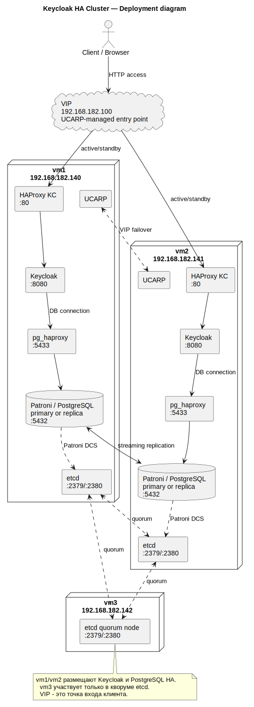

# Keycloak HA Cluster

Учебный проект по развёртыванию отказоустойчивой системы авторизации на базе Keycloak. Стенд рассчитан на три виртуальные машины Debian и автоматизируется через Ansible.

Проект демонстрирует связку:

- **Keycloak** — сервер авторизации и управления пользователями;
- **PostgreSQL + Patroni** — отказоустойчивая база данных с автоматическим переключением лидера;
- **etcd** — распределённое хранилище состояния для Patroni;
- **HAProxy** — балансировка трафика к Keycloak и PostgreSQL;
- **UCARP** — переключение виртуального IP-адреса между узлами;
- **Ansible** — автоматизированное развёртывание всех компонентов.

> Проект предназначен для учебного стенда и демонстрации принципов отказоустойчивости. Для production-эксплуатации требуются дополнительные меры: TLS, Ansible Vault/секрет-хранилище, firewall, резервное копирование PostgreSQL, мониторинг и ограничение административных интерфейсов.

---

## Архитектура стенда



### Роли узлов

| Узел | Hostname | IP | SSH user | Назначение |
|---|---|---:|---|---|
| vm1 | `test-vm1` | `192.168.182.140` | `keycloak-vm1` | Keycloak, HAProxy, Patroni/PostgreSQL, etcd, UCARP |
| vm2 | `test-vm2` | `192.168.182.141` | `keycloak-vm2` | Keycloak, HAProxy, Patroni/PostgreSQL, etcd, UCARP |
| vm3 | `test-vm3` | `192.168.182.142` | `keycloak-vm3` | etcd quorum node |
| VIP | — | `192.168.182.100` | — | клиентская точка входа к Keycloak |

---

## Структура проекта

```text
.
├── ansible/
│   ├── ansible.cfg
│   ├── inventory.yml
│   ├── site.yml
│   ├── group_vars/
│   │   └── all/
│   │       ├── main.yml
│   │       └── secrets.yml        # локальный файл, не должен попадать в Git
│   ├── templates/
│   │   └── env.j2
│   └── roles/
│       ├── common/
│       ├── project/
│       ├── etcd/
│       ├── docker_images/
│       ├── patroni/
│       ├── pg_haproxy/
│       ├── keycloak/
│       ├── keycloak_haproxy/
│       ├── preflight/
│       └── ucarp/
├── config/
│   ├── keycloak-haproxy/
│   ├── patroni/
│   ├── pg-haproxy/
│   └── ucarp/
├── docker-compose-etcd.yml
├── docker-compose-patroni.yml
├── docker-compose-pg-haproxy.yml
├── docker-compose-keycloak.yml
├── docker-compose-keycloak-haproxy.yml
├── haproxy-image/
├── patroni-image/
└── scripts/
```

---

## Где менять параметры

Ветка `refactor-centralized-ansible-vars` разделяет изменяемые параметры по смыслу.

### 1. Топология стенда

Файл:

```text
ansible/inventory.yml
```

Здесь меняются:

- IP-адреса VM;
- SSH-пользователи;
- hostname узлов;
- VIP;
- сетевой интерфейс;
- распределение узлов по группам Ansible.

Пример:

```yaml
vm1:
  ansible_host: 192.168.182.140
  ansible_user: keycloak-vm1
  host_ip: 192.168.182.140
  node_hostname: test-vm1
  etcd_name: etcd-vm1
  patroni_name: test-vm1
  node_role: keycloak_node
  ucarp_advskew: 10
```

Если поменялись IP-адреса, обычно достаточно изменить `ansible_host`, `host_ip` и `vip` в `inventory.yml`.

### 2. Несекретные настройки сервисов

Файл:

```text
ansible/group_vars/all/main.yml
```

Здесь меняются:

- порты сервисов;
- версии образов;
- параметры healthcheck;
- имя базы Keycloak;
- параметры etcd/Patroni;
- имя проекта Docker Compose.

### 3. Секреты сервисов

Файл:

```text
ansible/group_vars/all/secrets.yml
```

Этот файл должен существовать локально, но не должен попадать в публичный репозиторий.

Минимальный пример:

```yaml
---
postgres_password: postgres_pass

replication_username: replicator
replication_password: replicator_pass

keycloak_db_password: keycloak_pass

keycloak_admin: admin
keycloak_admin_password: admin_pass

haproxy_stats_user: admin
haproxy_stats_password: admin123

ucarp_password: keycloak-ha-vip
```

Для production-сценария вместо обычного `secrets.yml` следует использовать Ansible Vault или внешнее секрет-хранилище.

---

## Требования к виртуальным машинам

Перед запуском Ansible на чистых VM должны быть выполнены базовые условия:

1. Установлен Debian.
2. Настроены статические IP-адреса.
3. Работает DNS и доступ в интернет.
4. Установлен и запущен SSH-сервер.
5. Созданы пользователи:
   - `keycloak-vm1` на vm1;
   - `keycloak-vm2` на vm2;
   - `keycloak-vm3` на vm3.
6. Пользователи имеют право выполнять команды через `sudo`.
7. На управляющей машине vm1 установлен Ansible.

---

## Подготовка управляющей машины

На vm1:

```bash
sudo apt update
sudo apt install -y git ansible openssh-client
```

Клонировать репозиторий:

```bash
cd /opt
sudo git clone https://github.com/daniil4132-bit/keycloak-ha.git
sudo chown -R keycloak-vm1:keycloak-vm1 /opt/keycloak-ha
cd /opt/keycloak-ha
```

Переключиться на нужную ветку:

```bash
git checkout refactor-centralized-ansible-vars
```

---

## Настройка SSH-ключей

Ansible запускается с vm1 и подключается к vm1/vm2/vm3 по SSH.

На vm1 под пользователем `keycloak-vm1`:

```bash
ssh-keygen -t ed25519 -C "ansible-keycloak-ha"
```

Скопировать ключ на все узлы:

```bash
ssh-copy-id keycloak-vm1@192.168.182.140
ssh-copy-id keycloak-vm2@192.168.182.141
ssh-copy-id keycloak-vm3@192.168.182.142
```

Проверить подключение без пароля:

```bash
ssh keycloak-vm1@192.168.182.140 hostname
ssh keycloak-vm2@192.168.182.141 hostname
ssh keycloak-vm3@192.168.182.142 hostname
```

---

## Создание локального файла секретов

Если файла `ansible/group_vars/all/secrets.yml` нет, создать его:

```bash
cd /opt/keycloak-ha
mkdir -p ansible/group_vars/all

cat > ansible/group_vars/all/secrets.yml <<'EOF'
---
postgres_password: postgres_pass

replication_username: replicator
replication_password: replicator_pass

keycloak_db_password: keycloak_pass

keycloak_admin: admin
keycloak_admin_password: admin_pass

haproxy_stats_user: admin
haproxy_stats_password: admin123

ucarp_password: keycloak-ha-vip
EOF
```

Проверить, что файл не будет добавлен в Git:

```bash
git status --short
```

---

## Проверка Ansible

Перейти в каталог Ansible:

```bash
cd /opt/keycloak-ha/ansible
```

Проверить структуру inventory:

```bash
ansible-inventory --graph
```

Проверить доступность узлов:

```bash
ansible all -m ping
```

Проверить sudo:

```bash
ansible all -m command -a "whoami" --become --ask-become-pass
```

Ожидаемый результат:

```text
root
```

---

## Запуск preflight-проверок

```bash
ansible-playbook site.yml --tags preflight
```

Preflight проверяет базовые условия: поддерживаемый Debian, DNS и доступность внешних репозиториев.

---

## Полное развёртывание

```bash
ansible-playbook site.yml --ask-become-pass
```

Playbook выполняет следующие этапы:

1. Подготовка временного каталога Ansible.
2. Preflight-проверки.
3. Установка базовых пакетов и Docker.
4. Доставка проекта на узлы.
5. Генерация `.env` и конфигурационных файлов из шаблонов.
6. Запуск etcd-кластера.
7. Запуск Patroni/PostgreSQL.
8. Запуск HAProxy для PostgreSQL.
9. Запуск Keycloak.
10. Запуск HAProxy для Keycloak.
11. Установка и запуск UCARP.

---

## Проверка после развёртывания

### Контейнеры

На vm1 и vm2:

```bash
docker ps --format "table {{.Names}}\t{{.Status}}\t{{.Ports}}"
```

Ожидаемые контейнеры:

```text
etcd
patroni
pg_haproxy
keycloak
keycloak_haproxy
```

На vm3:

```bash
docker ps --format "table {{.Names}}\t{{.Status}}\t{{.Ports}}"
```

Ожидаемый контейнер:

```text
etcd
```

### etcd

```bash
docker exec -it etcd etcdctl \
  --endpoints=http://192.168.182.140:2379,http://192.168.182.141:2379,http://192.168.182.142:2379 \
  endpoint health
```

### Patroni/PostgreSQL

На vm1 или vm2:

```bash
docker exec -it patroni patronictl -c /etc/patroni/patroni.yml list
```

Ожидаемо:

- один узел в роли `Leader`;
- второй узел в роли `Replica` или `Sync Standby`;
- состояние узлов `running`/`streaming`;
- lag равен нулю или минимален.

### Keycloak напрямую

На vm1 и vm2:

```bash
curl -i http://127.0.0.1:8080/realms/master
```

Ожидаемо:

```text
HTTP/1.1 200 OK
```

### HAProxy Keycloak локально

На vm1 и vm2:

```bash
curl -i http://127.0.0.1/realms/master
```

Ожидаемо:

```text
HTTP/1.1 200 OK
```

### VIP

На vm1 и vm2:

```bash
ip -br addr | grep 192.168.182.100 || true
```

VIP должен быть только на одном из двух узлов.

Проверка клиентского доступа:

```bash
curl -i http://192.168.182.100/realms/master
```

Ожидаемо:

```text
HTTP/1.1 200 OK
```

Административная консоль:

```text
http://192.168.182.100/admin
```

---

## Проверка отказоустойчивости

### 1. Отказ активного HAProxy Keycloak

Найти узел с VIP:

```bash
ip -br addr | grep 192.168.182.100 || true
```

На узле, где находится VIP, остановить Keycloak HAProxy:

```bash
cd /opt/keycloak-ha
docker compose --env-file .env -f docker-compose-keycloak-haproxy.yml stop
```

Через 20–40 секунд проверить на втором узле:

```bash
ip -br addr | grep 192.168.182.100 || true
curl -i http://192.168.182.100/realms/master
```

VIP должен перейти на второй узел, а Keycloak должен остаться доступным.

Вернуть HAProxy:

```bash
cd /opt/keycloak-ha
docker compose --env-file .env -f docker-compose-keycloak-haproxy.yml start
```

> VIP может не вернуться автоматически на исходный узел. Это ожидаемое поведение, так как автоматическое вытеснение активного узла отключено.

### 2. Отказ PostgreSQL Leader

Посмотреть текущего Leader:

```bash
docker exec -it patroni patronictl -c /etc/patroni/patroni.yml list
```

На узле Leader остановить Patroni:

```bash
cd /opt/keycloak-ha
docker compose --env-file .env -f docker-compose-patroni.yml stop
```

На втором узле проверить смену роли:

```bash
docker exec -it patroni patronictl -c /etc/patroni/patroni.yml list
curl -i http://192.168.182.100/realms/master
```

Вернуть Patroni:

```bash
cd /opt/keycloak-ha
docker compose --env-file .env -f docker-compose-patroni.yml start
```

### 3. Отказ одного etcd-узла

На vm3:

```bash
cd /opt/keycloak-ha
docker compose --env-file .env -f docker-compose-etcd.yml stop
```

Проверить, что кластер продолжает работать:

```bash
docker exec -it patroni patronictl -c /etc/patroni/patroni.yml list
curl -i http://192.168.182.100/realms/master
```

Вернуть etcd:

```bash
cd /opt/keycloak-ha
docker compose --env-file .env -f docker-compose-etcd.yml start
```

---

## Изменение IP-адресов и hostname

Если меняются IP-адреса, SSH-пользователи, hostname или VIP, изменить файл:

```text
ansible/inventory.yml
```

После изменения проверить:

```bash
cd /opt/keycloak-ha/ansible
ansible-inventory --graph
ansible all -m ping
ansible-playbook site.yml --syntax-check
```

Затем выполнить playbook:

```bash
ansible-playbook site.yml --ask-become-pass
```

Ручное изменение `.env`, `config/patroni/patroni.yml`, HAProxy-конфигов и systemd unit-файлов UCARP не требуется: они генерируются Ansible из шаблонов.

---

## Изменение паролей

Пароли сервисов меняются в локальном файле:

```text
ansible/group_vars/all/secrets.yml
```

После изменения выполнить:

```bash
cd /opt/keycloak-ha/ansible
ansible-playbook site.yml --ask-become-pass
```

Если меняется пароль пользователя Keycloak в PostgreSQL, роль Patroni должна привести пользователя базы данных к значению из переменных Ansible.

---

## Полезные команды диагностики

### Логи Keycloak

```bash
docker logs keycloak --tail 100
```

### Логи Patroni

```bash
docker logs patroni --tail 100
```

### Состояние UCARP

```bash
sudo systemctl status ucarp --no-pager
sudo systemctl status ucarp-healthcheck --no-pager
```

### Журналы UCARP

```bash
sudo journalctl -u ucarp --since "15 minutes ago" --no-pager
sudo journalctl -u ucarp-healthcheck --since "15 minutes ago" --no-pager
```

### HAProxy stats

Keycloak HAProxy:

```text
http://192.168.182.100:8404/stats
```

PostgreSQL HAProxy:

```text
http://127.0.0.1:7000/stats
```

---

## Ограничения текущего стенда

Текущая конфигурация подходит для учебного стенда, но не является production-ready без дополнительных мер.

Основные ограничения:

- Keycloak работает по HTTP, без TLS.
- etcd работает без TLS и без аутентификации.
- Patroni REST API доступен в локальной сети без отдельной защиты.
- PostgreSQL `pg_hba` в учебном варианте может быть открыт шире, чем требуется для production.
- Нет автоматизированной системы резервного копирования PostgreSQL.
- Нет централизованного мониторинга и алертинга.
- Секреты должны храниться локально или через Ansible Vault, а не в публичном репозитории.

Для production-эксплуатации рекомендуется добавить:

- TLS-терминацию на HAProxy или полноценный HTTPS для Keycloak;
- доменное имя вместо доступа по IP;
- Ansible Vault или внешнее секрет-хранилище;
- firewall-ограничения между узлами;
- TLS для etcd и Patroni API;
- регулярные PostgreSQL backup и проверку восстановления;
- мониторинг состояния Keycloak, PostgreSQL, Patroni, etcd, HAProxy и UCARP.

---

## Итог

Проект позволяет воспроизводимо развернуть отказоустойчивый учебный стенд Keycloak на трёх виртуальных машинах. Основной результат — автоматизация развёртывания через Ansible и демонстрация переключения сервисов при отказе отдельных компонентов.

